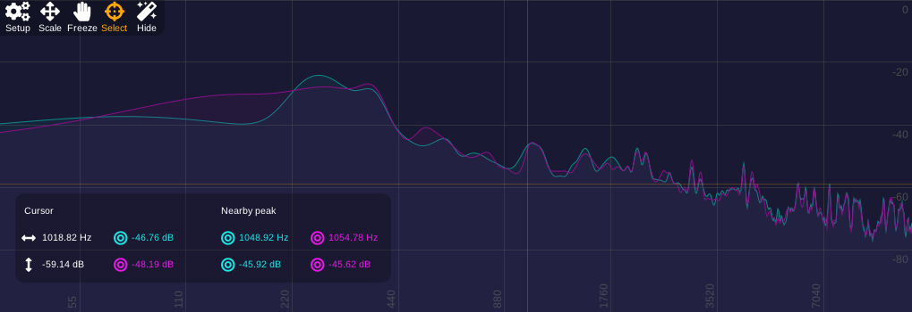

# Spectacle

A graphical spectral analyzer

## Introduction

Spectacle is a real-time spectral analyzer using the short-time Fourier transform, available as LV2 audio plugin and JACK client.

- display the spectrum on logarithmic musical scale
- control the parameters of the analysis that affect latency and precision
- have zoom functionality and smooth interpolation
- identify the value under cursor and the peaks

## Controls

- **algorithm**
  - _STFT_: sliding discrete Fourier transform
  - _STFT xN_: multi-rate STFT, providing a more precise lower spectrum for smaller resolutions
- **resolution**: number of frequency points evaluated by STFT, greater CPU load in high values
- **step**: linked to the rate of STFT updates, faster when low but also more CPU consuming
- **attack time**: reaction delay to rapid increases of amplitude
- **release time**: reaction delay to rapid decreases of amplitude

## Compatibility notes

Some hosts on Linux, including Carla (as of 2.3.0), are unable to turn off the DSP when the VST editor is closed.
The LV2 version is recommended in this case.

## Change log

**2.0**
- added accelerated OpenGL graphics
- improved the default color scheme for readability
- added multi-rate algorithms, to increase resolution in the low frequency range
- adopted a more musically-relevant grid scale, and drawn minor grid lines
- added support of custom palettes in manually written theme files
- added a resizing handle
- eliminated the requirement of `xxd` for building
- renamed the standalone to avoid a conflict with existing programs

**1.0**

- initial release

## Contributors

- @trebmuh, [LibraZiK](https://librazik.tuxfamily.org/): documentation
- @rghvdberg: software name
- @alcomposer, @unfa: suggestions for improvement
- @falkTX: the DISTRHO Plugin Framework, code contributions
